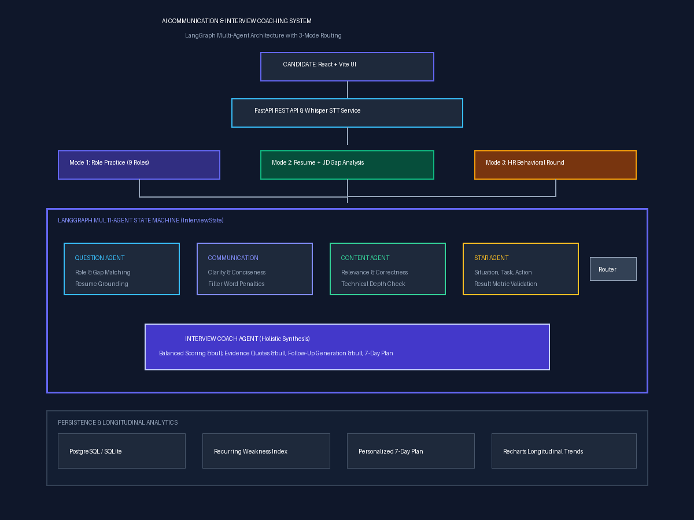

# AI-Powered Communication & Interview Coaching System

[](https://fastapi.tiangolo.com)
[](https://github.com/langchain-ai/langgraph)
[](https://react.dev)
[](https://www.docker.com)
[]()
[]()

An advanced, production-grade AI platform that transforms traditional static mock interviews into an adaptive, multi-agent coaching experience. Built using **LangGraph**, **FastAPI**, **React**, and **PostgreSQL/SQLite**, the system evaluates candidate spoken and written answers across communication clarity, technical depth, and STAR behavioral structure.

---

## 🌟 Key Features

### 1. Three Core Interview Modes with Autonomous LLM Calibration & Crisp 1-2 Line Questions
- **Autonomous LLM Session Planning:** The LLM independently determines the optimal number of questions (3 to 6) and dynamic difficulty progression (easy, medium, hard) based on candidate experience, role depth, and detected skill gaps with zero manual intervention required.
- **Strict 1 to 2 Line Question Length:** Every generated question is strictly enforced to be punchy, direct, and between 1 to 2 lines (~15–35 words), eliminating chatty preambles and robotic fluff.
- **Mode 1 — Role Practice:** Select from 9 preset roles (*SDE, Full Stack, AI/ML, Cloud, DevOps, Data Analyst, Product Manager, Sales, Customer Success*) with LLM-generated questions tailored to core engineering competencies.
- **Mode 2 — Resume + Job Description:** Direct PDF/TXT parsing with automated gap analysis. Probes claimed resume projects, production experience, and unaddressed JD requirements without hallucinations.
- **Mode 3 — HR Behavioral Round:** Role-agnostic situational practice evaluated strictly against the STAR framework.

### 2. Interview Preparation & Skill Improvement Roadmap
- **Curated Problem Bank (LeetCode & CodeChef):** Algorithmic problems organized by pattern (*Two Pointers, Sliding Window, Monotonic Stack, Graphs / 0-1 BFS, Dynamic Programming, 0-1 Knapsack*) with direct platform links, difficulty badges, and architectural pattern hints.
- **Interactive Completion Tracker:** Candidate checklist with real-time completion percentages and `localStorage` state persistence.
- **Curated Reference Curriculum:** Direct links and summaries to foundational engineering references:
  - *Designing Data-Intensive Applications* (Martin Kleppmann)
  - *The System Design Primer* (Donne Martin)
  - Stripe Distributed Idempotency Architectures
  - High-Scale Rate Limiting & Token Bucket Algorithms
  - Apache Kafka Partitioning & Ordering Guarantees
  - PostgreSQL Indexing & B-Tree Execution Planning
  - Python Asyncio Event Loop & Concurrency Primitives
  - STAR Behavioral Executive Masterclass

### 3. Profile & Resume Intelligence Center
- **Candidate Login & Switcher:** Seamlessly log in, switch candidates, or auto-register using Candidate ID, email, or name.
- **Direct Resume Upload & Auto-Sync:** Upload `.pdf` or `.txt` resumes directly. Automatically extracts skills, project experiences, metrics, and bio via PyPDF and intelligent heuristics, syncing them into the database.
- **Profile Executive Summary:** Real-time synthesized candidate profile overview highlighting seniority tier, background, and core technology stack.
- **Production Portfolio & Project Stats:** Tracks candidate projects, technologies employed, and quantifiable impact metrics (e.g. *3,200 RPS, 95% latency reduction, 99.9% uptime*).
- **Role Capability & Readiness Matrix:** Evaluates what roles the candidate is capable of across 7 industry disciplines:
  1. Software Development Engineer (SDE / Backend)
  2. Full Stack Developer
  3. DevOps & Cloud Engineer
  4. AI / Machine Learning Engineer
  5. Data Analyst / Data Engineer
  6. Site Reliability Engineer (SRE)
  7. Technical Product Manager
  *Provides fit percentages, readiness status badges (Interview Ready, Strong Candidate, Minor Ramp-Up, Foundational Growth), matched capabilities, and prioritized skills to learn.*

### 4. LangGraph Multi-Agent Orchestration
Coordinates specialized agents over a shared `InterviewState` typed dictionary with conditional routing:
- **Question Agent:** Dynamically retrieves or generates questions tailored to role, difficulty, resume facts, and candidate history.
- **Communication Agent:** Evaluates clarity, conciseness, structural cohesion, filler words (`um`, `like`, `basically`), and delivery cadence.
- **Content Agent:** Assesses technical depth, correctness, completeness, and evidence quality.
- **STAR Structure Agent:** Evaluates Situation, Task, Action (personal ownership vs passive "we"), and Result (quantifiable metrics).
- **Coach Agent:** Synthesizes findings into balanced overall scores, prioritized evidence items, improved answer restructuring, adaptive follow-up questions, and longitudinal improvement roadmaps.
- **Conditional Agent Handoff:** Triggers deeper specialist diagnostics when clarity or technical depth falls below threshold.

### 5. Cadence Shadowing Studio & Voice Pipeline
- Whisper-compatible audio ingestion supporting microphone recording in the browser.
- Analyzes physical delivery metrics (speaking rate in WPM, pause frequencies, filler word counts) while rejecting pseudo-scientific psychological inference.
- **Cadence Shadowing Studio:** Practice rephrasing answers thought-by-thought against the 135 WPM executive standard (120–150 WPM) with real-time audio playback and pacing scoring.

### 6. Longitudinal Progress & Adaptive Growth
- **Recurring Weakness Detection:** Automatically tracks recurring gaps that appear across multiple sessions (e.g. "Missing Measurable Outcomes").
- **7-Day Personalized Improvement Plan:** Generates targeted day-by-day practice schedules tailored to the candidate's historical gaps.
- **Interactive Analytics:** Visualizes score trends, communication clarity, and technical mastery over time using Recharts.

---

## 🏛️ System Architecture



```
[Candidate: Voice/Text] ──> [FastAPI Backend] ──> [LangGraph State Machine]
                                                        │
                      ┌─────────────────────────────────┼─────────────────────────────────┐
                      ▼                                 ▼                                 ▼
             [Communication Agent]               [Content Agent]                    [STAR Agent]
                      │                                 │                                 │
                      └─────────────────────────────────┼─────────────────────────────────┘
                                                        │
                                            [Conditional Handoff]
                                                        │
                                                        ▼
                                                  [Coach Agent]
                                                        │
                      ┌─────────────────────────────────┼─────────────────────────────────┐
                      ▼                                 ▼                                 ▼
            [Evidence-Based Feedback]          [Follow-Up Question]             [7-Day Action Plan]
```

---

## 🚀 Quickstart Guide

### Option A: Local Development (Recommended for quick testing)

#### 1. Clone & Set Up Backend
```bash
# Activate virtual environment
python -m venv venv
.\venv\Scripts\activate   # Windows
# source venv/bin/activate # Linux/macOS

# Install dependencies
pip install -r backend/requirements.txt

# Seed question bank and default demo candidate
python scripts/seed_database.py

# Start FastAPI server (runs on port 8000)
cd backend
uvicorn app.main:app --reload --host 0.0.0.0 --port 8000
```

#### 2. Set Up Frontend
```bash
# In a new terminal:
cd frontend
npm install
npm run dev
# Open browser at http://localhost:5173
```

---

### Option B: Docker Compose Deployment

Run the complete multi-container stack (PostgreSQL + FastAPI Backend + Nginx Frontend):
```bash
docker-compose up --build -d
```
- Web Application: `http://localhost:5173` (or `http://localhost:80`)
- Backend API Docs: `http://localhost:8000/docs`
- Health check: `http://localhost:8000/health`

---

## 💡 Sample Usage Walkthrough

### 1. Interview Question Selection (Mode 1 — Role Practice: SDE)
- **Role:** Software Development Engineer (SDE)
- **Competency:** Problem Solving & Backend Systems
- **Difficulty:** Medium
- **Prompt:**
  > *"How would you optimize a Python API endpoint that is experiencing high latency under heavy traffic?"*

### 2. Candidate Response Input (Voice or Text)
> *"In my previous role at a fintech startup, our payment verification endpoint was hitting 2.8s response times during peak flash sales. As the lead backend engineer, I began by attaching cProfile and py-spy to capture flamegraphs in staging under simulated load. The profiling revealed two major bottlenecks: a classic N+1 ORM query fetching user ledger records, and unindexed foreign key lookups on the transactions table. I refactored the ORM calls to use eager loading with `select_related`, added composite B-Tree indexes on `(user_id, created_at)`, and introduced a Redis caching layer with a 60-second TTL for idempotent balance checks. This reduced average endpoint latency from 2.8s to 140ms (a 95% reduction) and scaled throughput from 250 to 3,200 requests per second."*

### 3. Resulting Multi-Agent Coaching Feedback
- **Overall Score:** `87.5 / 100` (Strong Candidate)
- **Communication Analysis (Score: 8.8/10):**
  - Pace: 138 WPM (Optimal executive range: 120–150 WPM).
  - Filler Words: 0 detected. Clear, concise, active voice.
- **Content & Depth Analysis (Score: 9.0/10):**
  - High domain depth: explicitly cites profiling tools (`cProfile`, `py-spy`), database indexing, and caching.
- **STAR Behavioral Structure (Score: 8.5/10):**
  - **Situation:** Flash sale traffic spike causing 2.8s latency.
  - **Task:** Lead engineer tasked with performance remediation.
  - **Action:** Profiling with flamegraphs, N+1 ORM eager loading, B-Tree composite indexing, Redis TTL cache.
  - **Result:** Latency dropped from 2.8s to 140ms (95% decrease); throughput increased to 3,200 RPS.
- **Follow-up Question:**
  > *"If the Redis cache experiences a cold restart during peak traffic, what stampede prevention pattern would you apply to avoid cascading database exhaustion?"*
- **Personalized 7-Day Improvement Plan:** Tailored schedule emphasizing cache stampede patterns, distributed locks, and circuit breaker resilience.

---

## 📊 Dataset & Benchmark Sources

Prepzo's question bank and benchmark evaluation suites are structured in compliance with standard industry interview corpora referenced in the Project Rubrics:
- **Primary Source:** **RecruitView** (Hugging Face Dataset)
- **Supplementary Sources:**
  - **Awesome Interview Questions** (Hugging Face / GitHub)
  - **Continuum Open-Source Interview Questions** (GitHub)
- **Schema Fields:** `question_id`, `role`, `competency`, `difficulty`, `question_type`, `expected_competencies`, `evaluation_criteria`, and `follow_up_template`.
- **Location:** [`data/processed/questions.json`](data/processed/questions.json) and [`data/evaluation/benchmark_dataset.json`](data/evaluation/benchmark_dataset.json).

---

## 🧪 Testing & Verification

### Run Backend Unit & Integration Tests (17 Tests)
```bash
$env:PYTHONPATH="backend"
pytest backend/tests -v
```
*Result: 17 passed (covers QuestionAgent, CommunicationAgent, ContentAgent, STARAgent, CoachAgent, ResumeJDService, LangGraph workflow, conditional routing, Candidate Login & Resume Sync, Role Capability Matcher, and FastAPI REST endpoints).*

### Run Automated Multi-Agent Benchmark Suite
```bash
$env:PYTHONPATH="backend"
python scripts/evaluate_agents.py
```
*Result: 100% Pass Rate across benchmark dataset with 0.0 points score variance (deterministic consistency).*

---

## 📚 Documentation Deliverables

Detailed technical documentation is available in the [`docs/`](docs/) directory:
- [Architecture & Workflow (`docs/architecture.md`)](docs/architecture.md)
- [System Architecture Vector Diagram (`docs/architecture.svg`)](docs/architecture.svg)
- [System Design & Engineering Decisions (`docs/design.md`)](docs/design.md)
- [Specialist Agents Reference (`docs/agents.md`)](docs/agents.md)
- [REST API Reference (`docs/api.md`)](docs/api.md)
- [Database Schema & Relationships (`docs/database.md`)](docs/database.md)
- [Evaluation Methodology & Benchmark Results (`docs/evaluation.md`)](docs/evaluation.md)
- [Deployment & Operations Guide (`docs/deployment.md`)](docs/deployment.md)
- [10-Minute Presentation & Demo Script (`docs/demo-script.md`)](docs/demo-script.md)

---

## 📝 License
MIT License. Built for the Google DeepMind Antigravity Advanced Agentic Coding Assessment.
