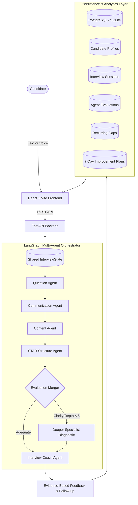
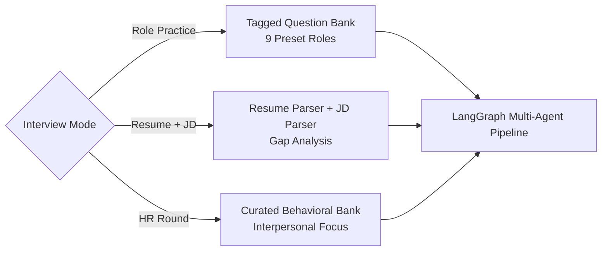

# System Architecture & Multi-Agent Design

## 1. System Overview

The **AI-Powered Communication & Interview Coaching System** is an enterprise-grade platform that coordinates specialized AI evaluation agents using **LangGraph** to provide actionable, evidence-based interview coaching and longitudinal progress tracking.



---

## 2. Mode-Aware LangGraph Routing

The application supports **three distinct interview modes**, each with custom question selection and agent evaluation emphasis:



### Mode 1 — Role Practice
- **Input:** Target Role (9 Presets: SDE, Full Stack, AI/ML, Cloud, DevOps, Data Analyst, Product Manager, Sales, Customer Success), difficulty, competency.
- **Workflow:** Filters tagged curated questions, considers past questions to prevent duplication.

### Mode 2 — Resume + Job Description
- **Input:** Resume (PDF or TXT) + Job Description text.
- **Workflow:** 
  1. `ResumeJDService` extracts candidate skills and projects.
  2. Parses required and preferred JD competencies.
  3. Conducts gap analysis to identify matched and missing competencies.
  4. Generates technical questions strictly grounded in resume facts.
  5. Generates behavioral probing questions for missing JD competencies.

### Mode 3 — HR Round
- **Input:** Behavioral topics (Conflict Resolution, Receiving Feedback, Stress Management, Motivation, Handling Failure, Teamwork).
- **Workflow:** Selects behavioral scenarios, enforces STAR framework evaluation, and focuses on interpersonal clarity.

---

## 3. LangGraph Shared State Schema

All specialist agents interact via the immutable `InterviewState` typed dictionary:

```python
class InterviewState(TypedDict, total=False):
    candidate_id: str
    candidate_profile: Dict[str, Any]
    target_role: str
    competency: str
    difficulty: str
    question_type: str
    current_question: str
    candidate_response: str
    transcript: Optional[str]
    audio_metrics: Optional[Dict[str, Any]]
    communication_analysis: Dict[str, Any]
    content_evaluation: Dict[str, Any]
    star_analysis: Dict[str, Any]
    deeper_communication_done: bool
    deeper_content_done: bool
    aggregated_score: float
    final_feedback: Dict[str, Any]
    follow_up_question: str
    recurring_gaps: List[Dict[str, Any]]
    improvement_plan: Dict[str, Any]
    session_history: List[Dict[str, Any]]
    next_action: str
```

---

## 4. Agent Responsibilities & Handoffs

| Agent | Responsibility | Core Metrics Evaluated |
|---|---|---|
| **Question Agent** | Selects or tailors interview questions | Role alignment, difficulty progression, history deduplication |
| **Communication Agent** | Analyzes delivery & articulation | Clarity (1-10), Conciseness (1-10), Structure (1-10), Filler words count, Speaking rate |
| **Content Agent** | Evaluates substance and domain depth | Relevance (1-10), Correctness (1-10), Technical Depth (1-10), Completeness (1-10), Evidence quality |
| **STAR Agent** | Evaluates behavioral structure | Situation, Task, Action, Result scores with direct quote evidence and restructuring guidance |
| **Coach Agent** | Final synthesis & longitudinal growth | Overall balanced score, consolidated strengths/gaps, actionable advice, follow-up generation, recurring gap detection, 7-day plan |

### Conditional Handoff Logic:
- If `Communication.clarity < 6` or `Content.technical_depth < 6`, LangGraph conditionally branches to `deeper_analysis` node.
- The deeper diagnostic isolates linguistic ambiguity or missing architectural invariants, feeding targeted guidance into the Coach Agent.
