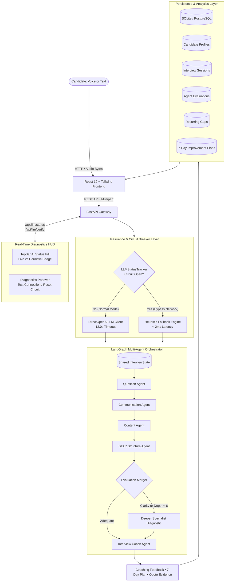
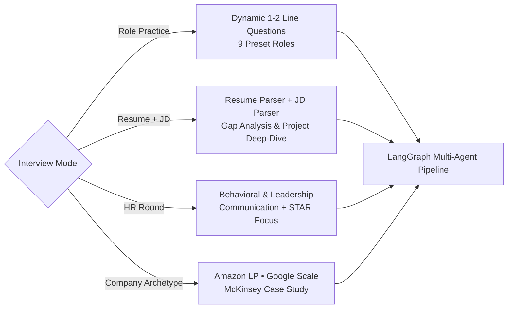
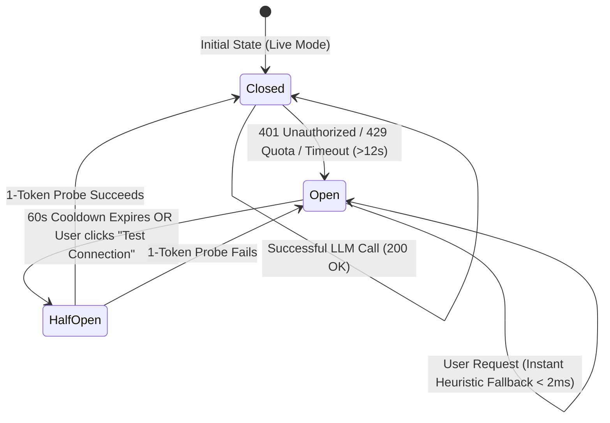

# System Architecture & Multi-Agent Design

## 1. System Overview

**Prepzo** is an enterprise-grade AI-powered communication and interview coaching platform designed with a **decoupled, multi-agent architecture** using **FastAPI (Python 3.10)**, **LangGraph**, and **React 19 (Tailwind CSS)**.

The system incorporates a **dual-mode operational engine**:
1. **Live AI Multi-Agent Mode**: Deep qualitative evaluation and dynamic question generation powered by LLMs (OpenAI `gpt-4o-mini`, Gemini, or compatible proxy gateways) with strict 12.0s timeouts and native JSON schema enforcement.
2. **Deterministic Heuristic Fallback Engine**: A local rule-based system powered by speech signal heuristics, NLP regex tokenizers, skills taxonomies, and weighted mathematical scoring matrices that trigger automatically if the external API key is invalid (401), rate-limited (429), unconfigured, or experiencing network timeout.



---

## 2. Mode-Aware LangGraph Routing

The application supports **four interview modes**, each with custom question selection and agent evaluation emphasis:



### Mode 1 — Role Practice
- **Input:** Target Role (9 Presets: SDE, Full Stack, AI/ML, Cloud, DevOps, Data Analyst, Product Manager, Sales, Customer Success), difficulty, competency.
- **Question Length:** Strictly enforced to 1 to 2 lines (~15–30 words) to eliminate conversational preambles.
- **Workflow:** Dynamically generates scenario questions testing troubleshooting, architectural trade-offs, concurrency, or performance optimization.

### Mode 2 — Resume + Job Description
- **Input:** Resume (PDF or TXT) + Job Description text.
- **Workflow:** 
  1. `ResumeJDService` extracts candidate skills and detected projects via `pypdf` and regex.
  2. Parses required and preferred JD competencies.
  3. Conducts gap analysis to identify matched and missing competencies.
  4. Turn 1 probes a specific candidate resume project; Turn 2 probes past production execution; subsequent turns probe critical JD gaps.

### Mode 3 — HR Behavioral Round
- **Input:** Behavioral topics (Conflict Resolution, Receiving Feedback, Stress Management, Motivation, Handling Failure, Teamwork).
- **Workflow:** Enforces STAR framework evaluation with weighted emphasis on personal leadership ownership (*"I"* vs passive *"we"*), vocal clarity, and business outcomes.

### Mode 4 — Company Archetypes
- **Amazon Leadership Principles:** Ownership, Customer Obsession, Bias for Action, Disagree & Commit, Dive Deep.
- **Google Scale & Engineering:** Distributed systems, 10M QPS caching, fault tolerance, concurrency invariants.
- **McKinsey Case Frameworks:** MECE problem decomposition, market sizing, digital transformation strategy.

---

## 3. Circuit Breaker & Fallback Architecture

To guarantee zero downtime and eliminate UI freezes when external LLM providers fail, Prepzo implements a dedicated circuit breaker inside [`backend/app/llm/provider.py`](file:///C:/Users/Administrator/Desktop/Prepzo/backend/app/llm/provider.py):



### Circuit Breaker States:
1. **Closed (Live Mode)**:
   - All agent requests query the LLM via `DirectOpenAILLM` with a 12.0s bounded timeout.
   - Successful calls reset error counters and mark `status: "live"`.
2. **Open (Fallback Mode)**:
   - When an unrecoverable API error occurs (`AuthenticationError`, `RateLimitError`, `APITimeoutError`), the circuit trips (`circuit_open = True`).
   - Subsequent calls bypass the network in $< 2\text{ ms}$ and immediately serve validated, domain-rich heuristic fallbacks.
   - User experiences zero lag and zero 500 errors.
3. **Half-Open (Probe Recovery)**:
   - After a **60-second cooldown**, the circuit allows a single lightweight 1-token test prompt (`"ping"`).
   - If the key is restored, the circuit resets to `Closed`. If still down, the cooldown resets.
   - Users can trigger this probe at any time via `POST /api/llm/verify`.

---

## 4. LangGraph Shared State Schema

All specialist agents interact via the immutable `InterviewState` typed dictionary:

```python
class InterviewState(TypedDict, total=False):
    candidate_id: str
    candidate_profile: Dict[str, Any]
    target_role: str
    competency: str
    difficulty: str
    question_type: str
    current_question: str
    candidate_response: str
    transcript: Optional[str]
    audio_metrics: Optional[Dict[str, Any]]
    communication_analysis: Dict[str, Any]
    content_evaluation: Dict[str, Any]
    star_analysis: Dict[str, Any]
    deeper_communication_done: bool
    deeper_content_done: bool
    aggregated_score: float
    final_feedback: Dict[str, Any]
    follow_up_question: str
    recurring_gaps: List[Dict[str, Any]]
    improvement_plan: Dict[str, Any]
    session_history: List[Dict[str, Any]]
    next_action: str
    mode: Optional[str]
```

---

## 5. Mathematical & Algorithmic Formulas

### Formula 1: Speech Delivery & Speaking Rate (WPM)
Calculates duration and vocal pacing:
$$\text{Duration (seconds)} = \begin{cases} \dfrac{\text{frames}}{\text{framerate}}, & \text{if WAV header valid} \\[6pt] \max\left(\dfrac{\text{len(bytes)}}{8000.0}, \; 5.0\right), & \text{if WEBM / MP3 fallback} \end{cases}$$

$$\text{Minutes} = \max\left(\frac{\text{Duration}_{\text{sec}}}{60.0}, \; 0.1\right), \qquad \text{WPM} = \text{round}\left(\frac{\text{Word Count}}{\text{Minutes}}, \; 1\right)$$

$$\text{Rating} = \begin{cases} \text{"Optimal (120–160 WPM)"}, & 120 \le \text{WPM} \le 160 \\ \text{"Fast (>160 WPM)"}, & \text{WPM} > 160 \\ \text{"Slow (<120 WPM)"}, & \text{WPM} < 120 \end{cases}$$

### Formula 2: Linguistic Complexity & Filler Penalty
$$\text{ASL (Average Sentence Length)} = \text{round}\left(\frac{\text{Word Count}}{\max(\text{Sentence Count}, \; 1)}, \; 1\right)$$

$$\text{Base Clarity} = \begin{cases} 9, & \text{if } \text{ASL} < 22 \\ 6, & \text{otherwise} \end{cases}, \qquad \text{Clarity} = \begin{cases} \max(3, \; \text{Base Clarity} - 4), & \text{if Filler Count} \ge 2 \\ \text{Base Clarity}, & \text{otherwise} \end{cases}$$

### Formula 3: Overall Coach Score Synthesis
Each specialist agent scores from $1 \text{ to } 10$:
- $\text{comm\_score} = \frac{\text{Clarity} + \text{Conciseness} + \text{Structure} + \text{Quality}}{4.0}$
- $\text{content\_score} = \frac{\text{Correctness} + \text{Technical Depth} + \text{Evidence Quality}}{3.0}$
- $\text{structure\_score} = \frac{\text{Situation} + \text{Task} + \text{Action} + \text{Result}}{4.0}$ (or `comm.structure` for technical questions)

#### A. HR / Behavioral Round Weighting:
*Hierarchy: Communication (35%) + STAR Leadership (35%) + Relevance/Empathy (20%) + Context (10%)*
$$\text{Score}_{\text{HR}} = (\text{comm\_score} \times 3.5) + (\text{structure\_score} \times 3.5) + (\text{relevance} \times 2.0) + (\text{content\_score} \times 1.0)$$
$$\text{Overall Score}_{\text{HR}} = \max\left(10.0, \; \min\left(100.0, \; \text{round}(\text{Score}_{\text{HR}}, \; 1)\right)\right)$$

#### B. Technical & Architecture Round Weighting:
*Hierarchy: Technical Content (40%) + Communication (30%) + Structure (20%) + Completeness (10%)*
$$\text{Score}_{\text{Tech}} = (\text{content\_score} \times 4.0) + (\text{comm\_score} \times 3.0) + (\text{structure\_score} \times 2.0) + (\text{completeness} \times 1.0)$$
$$\text{Overall Score}_{\text{Tech}} = \max\left(10.0, \; \min\left(100.0, \; \text{round}(\text{Score}_{\text{Tech}}, \; 1)\right)\right)$$

### Formula 4: Resume vs. Job Description Match Score
Let $R$ be parsed resume skills and $J$ be JD required skills:
$$\text{Matched} = J \cap R, \qquad \text{Missing} = J \setminus R$$
$$\text{Match Ratio} = \frac{|\text{Matched}|}{\max(1, \; |\text{Matched}| + |\text{Missing}|)}$$
$$\text{Match Score} = \max\left(35, \; \min\left(95, \; \text{round}(\text{Match Ratio} \times 100)\right)\right)$$

---

## 6. Verification & Defense Reference

For full review preparation, viva defense questions, and step-by-step formula derivations, refer to the complete guide:
- [Prepzo Comprehensive System Review Guide (`PREPZO_SYSTEM_REVIEW_GUIDE.md`)](../PREPZO_SYSTEM_REVIEW_GUIDE.md)
